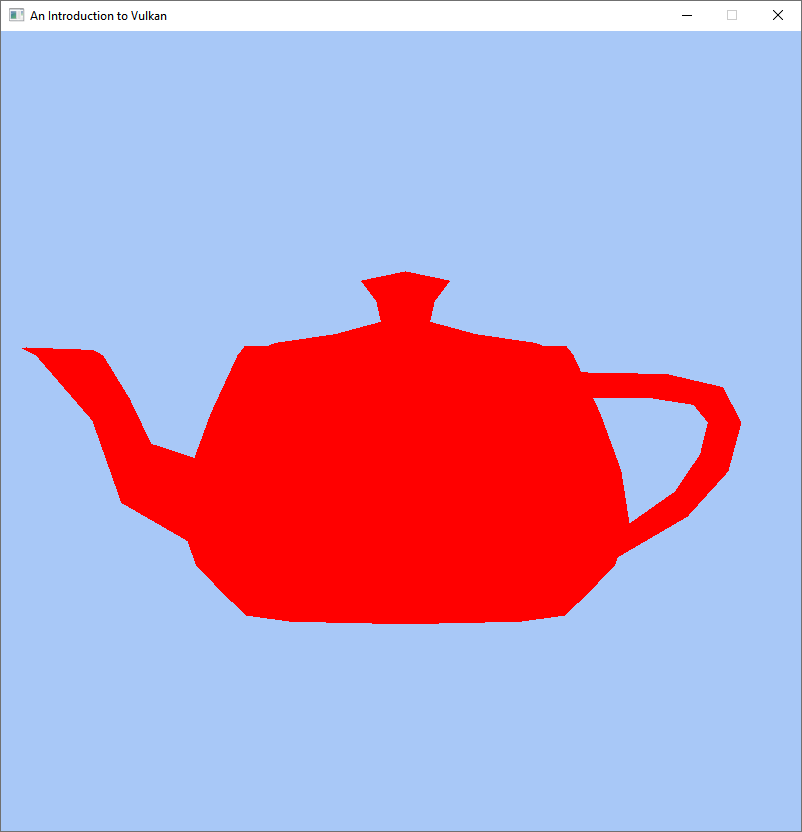

# Assignment 1: The Vulkan Boilerplate

This first assignment is all about setting up all the fundamental environment and Vulkan setup.
We will open an empty window, acquire the fundamental Vulkan handles, set up a basic swap chain, and implement a render loop which renders a teapot each frame.

### The Vulkan API
The default interface to Vulkan is a C-style interface. It is usable through a multitude of free functions in conjunction with their respective configuration structs. An instance, for example, can be created using the function [`vkCreateInstance`](https://registry.khronos.org/vulkan/specs/1.3-extensions/man/html/vkCreateInstance.html). Its corresponding configuration struct is [`VkInstanceCreateInfo`](https://registry.khronos.org/vulkan/specs/1.3-extensions/man/html/VkInstanceCreateInfo.html). This pattern is used across the entire Vulkan API. 

_Important:_ Whenever configuration structs are used, it is essential to explicitly set a configuration struct instance's type manually. It is a good idea to ensure that all the unused members are [zero-initialized](https://en.cppreference.com/w/c/language/initialization#Zero_initialization). This is especially important for pointer-type members! The following piece of code meets both of these requirements:

```cpp
VkInstanceCreateInfo instance_create_info = {}; // Zero-initialize every member
instance_create_info.sType = VK_STRUCTURE_TYPE_INSTANCE_CREATE_INFO; // Set the struct's type
```

Setting the type might seem a bit redundant, but it is absolutely necessary in Vulkan. Due to the C-style interface, many (additional) settings and parameters are passed by pointers, or assigned to the variables pointed to. As a concrete example from our given source code, an additional `VkApplicationInfo` is added to a `VkInstanceCreateInfo instance_create_info` struct as follows:

```cpp
instance_create_info.pApplicationInfo = &application_info;
```

### The Vulkan Specification 
In general, please pay close attention to the information given in the [Vulkan specification](https://registry.khronos.org/vulkan/specs/1.3-extensions/html/vkspec.html), where every function, struct, return value, etc. is documented comprehensively and precisely. Put differently, you generally do Vulkan programming by first looking into the specification, and secondly coding according to the information given. 

## Task 1.0: Run the Launchpad
Start by cloning the [Vulkan Launchpad Starter](https://new-git.dei.uc.pt/jaliborc/vulkanlaunchpad) template project (mirror also available [here](https://git.dei.uc.pt/jaliborc/VulkanLaunchpad/tree/main)) and open it using the [Visual Code](https://code.visualstudio.com/) IDE. Follow all the installation instructions for your operative system in the `README.md` closely. Then, make sure you are able to build and run the project.

With the project built and running, please open the source file `src/Main.cpp` and start working on the next tasks in the given order!

## Task 1.1: Create a Window with GLFW

Your first objective is to create a GLFW window as described in GLFW documentation: [Vulkan guide](https://www.glfw.org/docs/3.3.1/vulkan_guide.html#vulkan_window). Use the already prepared variables `window_width` and `window_height` to set the size of the window!

The provided source code already initializes our helper library GLFW, and it already sets some configuration parameters through calls to `glfwWindowHint`. The only thing left to be implemented for this task is the call to [`glfwCreateWindow`](`https://www.glfw.org/docs/3.3.1/group__window.html#ga3555a418df92ad53f917597fe2f64aeb`).

## Task 1.2: Create a Vulkan Instance

This is your first step into Vulkan territory. In order to access any Vulkan functionality, the first step required is creating a [`VkInstance`](https://registry.khronos.org/vulkan/specs/1.3-extensions/man/html/VkInstance.html). A corresponding [`VkInstanceCreateInfo`](https://registry.khronos.org/vulkan/specs/1.3-extensions/man/html/VkInstanceCreateInfo.html) config struct instance is already prepared in the source code for further usage.

Your objectives are:
- Enable extensions which are required by GLFW and by the framework!
- Enable the validation layer named `"VK_LAYER_KHRONOS_validation"`!
- Create a [`VkInstance`](https://registry.khronos.org/vulkan/specs/1.3-extensions/man/html/VkInstance.html) handle via [`vkCreateInstance`](https://registry.khronos.org/vulkan/specs/1.3-extensions/man/html/vkCreateInstance.html)!     
    _Hint:_ Pass `nullptr` to the `pAllocator` parameter to indicate that _no_ customm allocator shall be used. It is fine to pass `nullptr` to any of the `vkCreate...` functions' `pAllocator` parameters.
- Pass the created [`VkInstance`](https://registry.khronos.org/vulkan/specs/1.3-extensions/man/html/VkInstance.html) handle to the invocation of `vklInitFramework` later (namely during Task 1.8)!
 
As far as the [`VkInstanceCreateInfo`](https://registry.khronos.org/vulkan/specs/1.3-extensions/man/html/VkInstanceCreateInfo.html) config struct instance in our source code is concerned, you'll have to set the following members:
- `.enabledExtensionCount` and `.ppEnabledExtensionNames` describing the extensions which are required by GLFW any by the provided framework.     
    The extensions are already contained in `std::vector<const char*> required_extensions`.
    - **_Attention macOS users:_** On macOS, please add the `"VK_KHR_portability_enumeration"` extension! Feel free to use the following code: 
        ```cpp
        required_extensions.push_back(VK_KHR_PORTABILITY_ENUMERATION_EXTENSION_NAME);
        ```
        Furthermore, add the `VK_INSTANCE_CREATE_ENUMERATE_PORTABILITY_BIT_KHR` flag to `VkInstanceCreateInfo::flags` like so:
        ```cpp
        instance_create_info.flags = VK_INSTANCE_CREATE_ENUMERATE_PORTABILITY_BIT_KHR;
        ```
- `.enabledLayerCount` and `.ppEnabledLayerNames` describing the layers to be enabled.        
    The layers to be enabled are already contained in `std::vector<const char*> enabled_layers`.
- Then, with all required configuration parameters set, pass the `VkInstanceCreateInfo` instance to [`vkCreateInstance`](https://registry.khronos.org/vulkan/specs/1.3-extensions/man/html/vkCreateInstance.html) to create an instance!
    - Assign the created [`VkInstance`](https://registry.khronos.org/vulkan/specs/1.3-extensions/man/html/VkInstance.html) handle to the already prepared variable `VkInstance vk_instance`!        
    _Hint:_ See last parameter of [`vkCreateInstance`](https://registry.khronos.org/vulkan/specs/1.3-extensions/man/html/vkCreateInstance.html), which is an output parameter!

Ensure that all the Vulkan operations succeed by checking their returned [`VkResult`](https://registry.khronos.org/vulkan/specs/1.3-extensions/man/html/VkResult.html)! Feel free to use the macro `VKL_CHECK_VULKAN_RESULT`, which is provided by the framework.

## Task 1.3: Create a Vulkan Window Surface

Your next objective is to create a surface where we can draw upon with Vulkan. Use the function `glfwCreateWindowSurface` to achieve this goal! The [Vulkan guide](https://www.glfw.org/docs/3.3.1/vulkan_guide.html) from the GLFW documentation can be helpful also for completing this task.

## Task 1.4 Pick a Physical Device

Vulkan is a very explicit API where you have to specify precisely which physical device (i.e., which GPU) performs which tasks. Your objectives are to:
- Get the list of all physical devices using on your system using the API function [`vkEnumeratePhysicalDevices`](https://registry.khronos.org/vulkan/specs/1.3-extensions/man/html/vkEnumeratePhysicalDevices.html) and store the data in an array, or in a `std::vector<VkPhysicalDevice>`!
    - _Hint:_ You'll have to invoke `vkEnumeratePhysicalDevices` twice! Invoke it first with its last parameter set to `nullptr` in order to get the number of physical devices:          

            uint32_t num_physical_devices;
            VkResult result = vkEnumeratePhysicalDevices(vk_instance, &num_physical_devices, nullptr);
            VKL_CHECK_VULKAN_RESULT(result);

- Then pass that array or vector to the (already provided) function `selectPhysicalDeviceIndex` along with the created surface from Task 1.3!
- Finally, select the physical device which is represented by the index returned from `selectPhysicalDeviceIndex` and store its handle!

## Task 1.5: Select a Queue Family

All render work in Vulkan is submitted to a so-called "queue", which represents a queue of work on the device. All work that is submitted to such a queue will _start_ executing in the order of submission. 

The creation of one or multiple queues must be explicitly requested when creating a Vulkan device. In our case, we would like to keep things simple and request one single queue which supports two different types of operations:
1. Graphics (rendering into a framebuffer)         
    _Hint:_ Ensure that the [`VK_QUEUE_GRAPHICS_BIT`](https://registry.khronos.org/vulkan/specs/1.3-extensions/man/html/VkQueueFlagBits.html) is contained in a queue family's [`VkQueueFamilyProperties::queueFlags`](https://registry.khronos.org/vulkan/specs/1.3-extensions/man/html/VkQueueFamilyProperties.html)!
2. Presentation (of a rendered image to the screen).       
    _Hint:_ Ensure that [`vkGetPhysicalDeviceSurfaceSupportKHR`](https://registry.khronos.org/vulkan/specs/1.3-extensions/man/html/vkGetPhysicalDeviceSurfaceSupportKHR.html) indicates that presentation by a queue family of a physical device is supported.
   
Your objective is to complete the implementation of the already prepared function `selectQueueFamilyIndex` (at the bottom of the `src/Main.cpp` file) so that it returns the (globally unique!) queue family index of a queue family that supports both, graphics and presentation. Feel free to follow the implementation of the `selectPhysicalDeviceIndex` function (the implementation of which can be found in `src/VulkanHelpers.cpp`) when implementing `selectQueueFamilyIndex`!     
In order to complete this task, you just have to find one single `uint32_t` value, representing the queue family index to be used. Assign it to the already prepared variable `uint32_t selected_queue_family_index`!

We will need this queue family index in the next task, where we'll request the creation of one queue of the selected queue family. Concretely, this is requested by assigning the queue family index to `VkDeviceQueueCreateInfo::queueFamilyIndex` (see Task 1.6 below).    
Furthermore, we'll need the queue family index for the `VkSwapchainCreateInfoKHR::pQueueFamilyIndices` member during Task 1.7.

### Additional information about queues
Just because the work _starts_ executing in order does _not_ mean that it also _finishes_ execution in the same order. This information is, however, just given for completeness sake and is not relevant for your tasks at the moment.

Depending on the specific GPU, different kinds of queues can be available. Different such "kinds" are called "queue families" in Vulkan. Your specific system might support one or multiple queue families. It is generally possible to create multiple queues which belong to the same queue family (i.e., they are of the same kind).

## Task 1.6: Create a Logical Device and Get Queue

The logical device serves as the main interface to Vulkan. Your objective is to assemble a [`VkDeviceCreateInfo`](https://registry.khronos.org/vulkan/specs/1.3-extensions/man/html/VkDeviceCreateInfo.html) config struct instance and create a logical device using [`vkCreateDevice`](https://registry.khronos.org/vulkan/specs/1.3-extensions/man/html/vkCreateDevice.html)!

Create one instance of a [`VkDeviceCreateInfo`](https://registry.khronos.org/vulkan/specs/1.3-extensions/man/html/VkDeviceCreateInfo.html) struct, zero-initialize it, and set the following members:
- `.sType` to its appropriate value, which can be found in the documentation of [`VkDeviceCreateInfo`](https://registry.khronos.org/vulkan/specs/1.3-extensions/man/html/VkDeviceCreateInfo.html).
- `.queueCreateInfoCount` and `.pQueueCreateInfos` members to create a queue.     
    - _Hint:_ A suitable [`VkDeviceQueueCreateInfo`](https://registry.khronos.org/vulkan/specs/1.3-extensions/man/html/VkDeviceQueueCreateInfo.html) config struct instance is already prepared in the provided code. Just let the `.pQueueCreateInfos` member point to it in order to create one queue of the queue family selected during Task 1.5!
- Request to enable the `"VK_KHR_swapchain"` _device extension_ via the members `.enabledExtensionCount` and `.ppEnabledExtensionNames`!     
    - _Hint:_ Better use the macro `VK_KHR_SWAPCHAIN_EXTENSION_NAME` instead of stating `"VK_KHR_swapchain"` directly!
    - **_Attention macOS users:_** On macOS, please enable the `"VK_KHR_portability_subset"` extension too!

Now you can call [`vkCreateDevice`](https://registry.khronos.org/vulkan/specs/1.3-extensions/man/html/vkCreateDevice.html), and finally use [`vkGetDeviceQueue`](https://registry.khronos.org/vulkan/specs/1.3-extensions/man/html/vkGetDeviceQueue.html) to get the handle of the created queue!

## Task 1.7: Create Swap Chain

_Info:_ "A swap chain is a collection of buffers that are used for displaying frames to the user. Each time an application presents a new frame for display, the first buffer in the swap chain takes the place of the displayed buffer. This process is called swapping or flipping." [[Microsoft Docs]](https://docs.microsoft.com/en-us/windows/win32/direct3d9/what-is-a-swap-chain-)

The point of a swap chain is to have it contain multiple images s.t. one image can be currently displayed to the screen and at least one other image is currently being rendered into. These are often referred to as "front buffer" and "back buffer", respectively.

Your objective is to create a simple Vulkan swap chain by properly setting up a [`VkSwapchainCreateInfoKHR`](https://registry.khronos.org/vulkan/specs/1.3-extensions/man/html/VkSwapchainCreateInfoKHR.html) config struct, using that for [`vkCreateSwapchainKHR`](https://registry.khronos.org/vulkan/specs/1.3-extensions/man/html/vkCreateSwapchainKHR.html), and getting the created swap chain images.

Some properties are already set in the provided source code, but some are still missing.

Set the following elements of the `VkSwapchainCreateInfoKHR` stuct instance according to the Vulkan specification and the information given below:
- `.queueFamilyIndexCount` and `.pQueueFamilyIndices`: Let them point to the queue family index you have determined during Task 1.5!
- `.imageFormat` and `.imageColorSpace`: Set them to supported values, feel free to use the already provided `getSurfaceImageFormat` function!
- `.imageExtent`: Set it to the window's dimensions!
- `.presentMode`: Set it to [`VK_PRESENT_MODE_FIFO_KHR`](https://registry.khronos.org/vulkan/specs/1.3-extensions/man/html/VkPresentModeKHR.html), which is a mode that should be supported by all Vulkan-capable devices.

Finally, retrieve the handles of the created swap chain images with a call to [`vkGetSwapchainImagesKHR`](https://registry.khronos.org/vulkan/specs/1.3-extensions/man/html/vkGetSwapchainImagesKHR.html), writing them into the prepared `std::vector<VkImage> swap_chain_images`! The image handles are of type [`VkImage`](https://registry.khronos.org/vulkan/specs/1.3-extensions/man/html/VkImage.html) and its returned number should match the number set for the config struct's `.minImageCount` member, which is already set for you.

_Hint:_ Should you feel uncomfortable using a `std::vector`, feel free to turn `swap_chain_images` into an array! Otherwise, pass `swap_chain_images.data()` as the write-target—i.e., the last parameter of `vkGetSwapchainImagesKHR`.

## Task 1.8: Initialize Vulkan Launchpad

From this point onwards, our framework "Vulkan Launchpad" will take up several duties, s.t. you do not have to implement everything "on foot". Among those duties are:
- Handling which image is currently the front buffer and therefore, currently being presented to the screen.
- Handling which image is currently the back buffer and therefore, currently being rendered into.
- Handling the synchronization when it is safe to switch front and back buffer, after rendering has completed.
- Drawing a teapot, utilized in Parts 1 and 2.

To allow Vulkan Launchpad to properly initialize itself, all the handles that have been created during the previous Tasks must be passed ot its `vklInitFramework`. Ensure that it succeeded by asserting that its returned value is `true`! If it is not, end the program using the macro `VKL_EXIT_WITH_ERROR`! 

The last parameter of the function requires some more discussion: It expects a custom config struct instance of type `VklSwapchainConfig` containing the following data:
- `VklSwapchainConfig::imageExtent` shall be set to the size of the swap chain images (already set in the provided source code).
- `VklSwapchainConfig::swapchainHandle` shall be set to the swap chain handle as created with `vkCreateSwapchainKHR` during Task 1.7 (already set in the provided source code, if `vk_swapchain` has been assigned properly).
- `VklSwapchainConfig::swapchainImages` shall contain as many entries as there are swap chain images. E.g., if two swap chain images have been requested, the size of this vector shall be two. 
- For every entry of `VklSwapchainConfig::swapchainImages`:
    - Set appropriate image data for the `VklSwapchainFramebufferComposition::colorAttachmentImageDetails` member! Concretely, this means that you have to provide meaningful values for its `VklSwapchainImageDetails::imageHandle`, `VklSwapchainImageDetails::imageFormat`, `VklSwapchainImageDetails::imageUsage`, and `VklSwapchainImageDetails::clearValue` members. The data provided here must match the data of the swapchain image which has usage type `VK_IMAGE_USAGE_COLOR_ATTACHMENT_BIT` (hence the similar name).
        - Set each of swap chain image's clear colors to cornflower blue (RGBA value of `(0.39f, 0.58f, 0.93f, 1.0f)`)! 
        - _Note:_ Information about possible values to be set for `VklSwapchainImageDetails::clearValue` can be found in the Vulkan specification: [`VkClearValue`](https://registry.khronos.org/vulkan/specs/1.3-extensions/man/html/VkClearValue.html).
    - Leave the `VklSwapchainFramebufferComposition::depthAttachmentImageDetails` member in a zeroed-out state for now! In particular, ensure that its `VklSwapchainImageDetails::imageHandle` is set to `VK_NULL_HANDLE`, which means that no depth buffer is used for rendering.

_Note:_ In a later task, we will also be using the depth buffer attachment, but this is not required in PART 1.

## Task 1.9: Set-up the Render Loop

Usually, a render loop is used to draw objects again and again. One iteration of this loop is called a frame, and the number of iterations (or frames) per second are well known as FPS (frames per second). 

This loop has to run as long as the window is alive. The relevant status can be obtained with GLFW's [`glfwWindowShouldClose`](https://www.glfw.org/docs/latest/quick.html#quick_window_close) function, as already performed in the given code. Because objects should be rendered in every frame, the previous frame has to be cleared in order to avoid artifacts. Vulkan Launchpad will clear the swap chain's back buffer images before providing them for usage to the values that were configured during Task 1.8. 

Your objectives are:
- Add the following call directly before the render loop: `createTeapotGeometryAndBuffers();`
- Within the render loop you see a call to [`glfwPollEvents()`](https://www.glfw.org/docs/latest/group__window.html#ga37bd57223967b4211d60ca1a0bf3c832) to handle user input once per frame. Add the following calls after it:
    - Wait until the framework provides the next swap chain image for rendering into by calling `vklWaitForNextSwapchainImage()`!
    - Call `vklStartRecordingCommands()` to enable recording draw calls!
    - Use the provided helper function `drawTeapot()` to draw a teapot!
    - Call `vklEndRecordingCommands()` to finish recording draw calls and submit the command to the queue!
    - Instruct the framework to present the rendered image to the screen once rendering has completed by calling `vklPresentCurrentSwapchainImage()`!

**Some more details about `glfwPollEvents`:**
To make interaction possible, GLFW needs to be responsive to operating system events (e.g., mouse movement/clicks, key strokes, etc.), which is achieved by polling events. This usually happens at the start of every frame, before input is processed, by using the  GLFW function [`glfwPollEvents()`](https://www.glfw.org/docs/latest/group__window.html#ga37bd57223967b4211d60ca1a0bf3c832) which is to be invoked once per frame.     
_Note:_ Currently, the only input that our application reacts to is the `[Esc]` key which closes our window and subsequently leaves the render loop. 

**Some more details about front and back buffers:**
At the end of a frame, buffers need to be swapped and the backbuffer (which has been rendered into during the render loop iteration) needs to be be presented to the screen, which means turning it into the front buffer. This happens through the call to `vklPresentCurrentSwapchainImage()`. The buffer that was presented previously (i.e., the front buffer during the render loop iteration) is turned into the new back buffer. I.e., front and back buffers are swapped. This procedure is repeated every frame. Buffer swapping is handled internally by Vulkan Launchpad. You just need to ensure to invoke `vklWaitForNextSwapchainImage()` and `vklPresentCurrentSwapchainImage()`.

The rendering of the scene should look like follows:

<p align="center">
</img>
</p>

## Task 1.10: Cleanup

Your last objective is to cleanup everything you have created. This means:
- Calling `destroyTeapotBuffers()`
- Calling `vklDestroyFramework()` (already invoked in the provided code)
- Destroying the swapchain 
- Destroying the Vulkan device
- Destroying the surface
- Destroying the Vulkan instance
- Destroying the window
- Calling `glfwTerminate()`

_Hint:_ Functions that destroy resources start with `vkDestroy... in Vulkan. The rest of their name refers to the resource type—just like their corresponding `vkCreate...` counterparts.

_Hint:_ Also here, just pass `nullptr` to the functions' `pAllocator` parameters!

## Final Task: Delivery
Submit **only and exclusively** your `Main.cpp` file through Inforestudante before the deadline. Do **NOT** submit a `.zip` file. Your grade will further depend on the midterm questionaire.  
_Note: The work will be tested on a virtual Windows enviornment with NVIDIA GPU passthrough._

### Grading Policy
Submissions will be compiled and run automatically. It is the student's sole responsibility to ensure a successful submission. A grade of **0** will be automatically assigned, without exception, if:
* The submission contains missing or incorrect files, formats, or file names.
* The code fails to compile or execute correctly or contains malware.
* The submission is not received before the deadline.